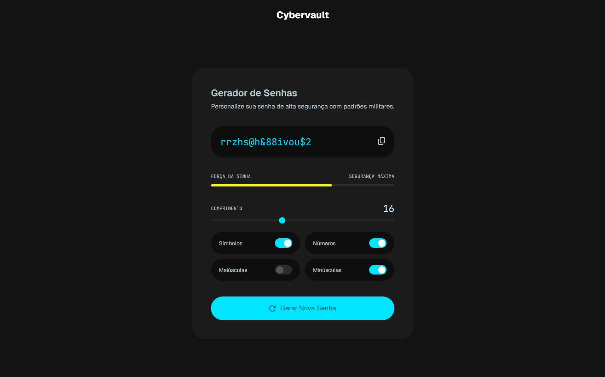

# Gerador de Senhas



Esse projeto gera senhas aleatórias com base em parâmetros pré-selecionados pelo usuário. Ele foi construído com HTML, CSS e JavaScript com a finalidade de fixar conhecimentos relacionados a linguagem de programação JavaScript.
## 🚀 Como rodar o projeto

### Pré-requisitos
- Um browser moderno (Chrome, Firefox, Edge)

### Instalação
1. Clone o repositório:
```bash
   git clone https://github.com/seu-usuario/gerador-senha.git
```
2. Acesse a pasta do projeto:
```bash
   cd gerador-senha
```
3. Abra o arquivo `index.html` no browser.

> Não é necessário instalar dependências ou rodar um servidor.
## 📖 Como usar

1. Escolha o **comprimento** da senha pelo slider
2. Selecione os **tipos de caracteres** desejados:
   - Símbolos (`!@#$%^&*()`)
   - Números (`0123456789`)
   - Letras maiúsculas (`A-Z`)
   - Letras minúsculas (`a-z`)
3. Clique em **"Gerar Nova Senha"**
4. Clique no ícone de **copiar** para copiar a senha gerada
## 📄 Licença

Este projeto está sob a licença MIT. Veja o arquivo [LICENSE](LICENSE) para mais detalhes.